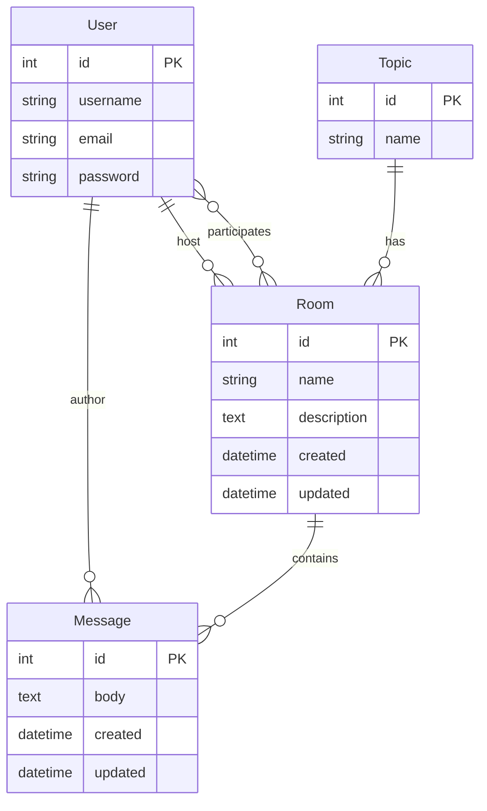

<div align="center">
  
  <h1>💬 ChatRooms</h1>
  <p><strong>Aplicación web de salas de chat en tiempo real</strong></p>
  <p>
    <a href="https://www.djangoproject.com/">
      
    </a>
    <a href="https://www.python.org/">
      
    </a>
    <a href="https://github.com/iroennys-admin/Chat-Rooms/actions">
      
    </a>
    <a href="LICENSE">
      
    </a>
  </p>
</div>

---

## ✨ Características

| Funcionalidad | Estado |
|---------------|--------|
| 🏠 **Salas de chat** — Crea, edita y elimina salas temáticas | ✅ |
| 💬 **Mensajería** — Envía mensajes en tiempo real dentro de cada sala | ✅ |
| 👥 **Participantes** — Únete a las salas y ve quién más está participando | ✅ |
| 🔍 **Búsqueda** — Filtra salas por nombre o por tema | ✅ |
| 🏷️ **Temas** — Organiza las salas por categorías (Tecnología, Música, etc.) | ✅ |
| 👤 **Perfiles** — Cada usuario tiene su perfil con sus salas y actividad | ✅ |
| 🔐 **Autenticación** — Registro, inicio de sesión y cierre de sesión | ✅ |
| 📱 **Responsive** — Diseño adaptado a móviles y tablets | ✅ |
| 🧪 **CI/CD** — Tests automáticos en cada push con GitHub Actions | ✅ |

## 📸 Capturas

<div align="center">
  <table>
    <tr>
      <td align="center"><strong>🏠 Home</strong></td>
      <td align="center"><strong>💬 Sala de chat</strong></td>
    </tr>
    <tr>
      <td></td>
      <td></td>
    </tr>
    <tr>
      <td align="center"><strong>➕ Crear sala</strong></td>
      <td align="center"><strong>👤 Perfil</strong></td>
    </tr>
    <tr>
      <td></td>
      <td></td>
    </tr>
  </table>
</div>

## 🚀 Inicio rápido

### Requisitos

- Python 3.11 o superior
- Pip (gestor de paquetes de Python)

### Instalación

```bash
# 1. Clona el repositorio
git clone https://github.com/iroennys-admin/Chat-Rooms.git
cd Chat-Rooms

# 2. Crea un entorno virtual
python -m venv .venv
source .venv/bin/activate  # Linux/macOS
# .venv\Scripts\activate   # Windows

# 3. Instala las dependencias
pip install -r requirements.txt

# 4. Ejecuta las migraciones
python manage.py makemigrations
python manage.py migrate

# 5. Inicia el servidor de desarrollo
python manage.py runserver
```

Abre [http://127.0.0.1:8000](http://127.0.0.1:8000) en tu navegador. 🎉

## 🏗️ Estructura del proyecto

```
Chat-Rooms/
├── .github/workflows/     # CI/CD con GitHub Actions
├── miproyecto/            # Configuración del proyecto Django
│   ├── settings.py        # Configuración principal
│   ├── urls.py            # Rutas raíz
│   ├── asgi.py            # Configuración ASGI
│   └── wsgi.py            # Configuración WSGI
├── principal/             # App principal
│   ├── templates/         # Plantillas HTML
│   │   ├── main.html      # Layout base
│   │   ├── navbar.html    # Barra de navegación
│   │   ├── principal/     # Templates de la app
│   │   └── registration/  # Templates de autenticación
│   ├── static/            # Archivos estáticos (CSS, JS)
│   ├── models.py          # Modelos: Room, Topic, Message
│   ├── views.py           # Lógica de las vistas
│   ├── forms.py           # Formularios
│   ├── admin.py           # Configuración del admin
│   └── urls.py            # Rutas de la app
├── manage.py              # CLI de Django
└── requirements.txt       # Dependencias
```

## 🧠 Modelos de datos



## 🧪 Tests

El proyecto incluye un pipeline de CI que ejecuta los tests automáticamente:

```bash
python manage.py test
```

## 🌐 Despliegue

### Render / Railway / PythonAnywhere

1. Conecta tu repositorio de GitHub
2. Configura el comando de inicio: `python manage.py runserver 0.0.0.0:8000`
3. Define las variables de entorno necesarias

### Docker (próximamente)

```dockerfile
FROM python:3.12-slim
WORKDIR /app
COPY requirements.txt .
RUN pip install -r requirements.txt
COPY . .
CMD ["python", "manage.py", "runserver", "0.0.0.0:8000"]
```

## 🤝 Contribuir

1. Haz fork del proyecto
2. Crea una rama (`git checkout -b feature/mi-feature`)
3. Commit (`git commit -m 'feat: añade mi feature'`)
4. Push (`git push origin feature/mi-feature`)
5. Abre un Pull Request

## 📄 Licencia

Este proyecto está bajo la licencia MIT. Ver el archivo [LICENSE](LICENSE) para más detalles.

---

<div align="center">
  <p>Hecho con ❤️ por <a href="https://github.com/iroennys-admin">@iroennys-admin</a></p>
  <p>
    <a href="https://github.com/iroennys-admin/Chat-Rooms/issues">Reportar un bug</a>
    ·
    <a href="https://github.com/iroennys-admin/Chat-Rooms/issues">Solicitar feature</a>
  </p>
</div>
